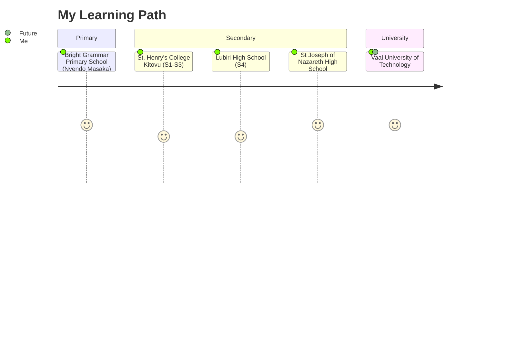

<div align="center">
  
  # ⚡️ Welcome to My Digital Garden 🌱
  
  [](https://git.io/typing-svg)

</div>

```ascii
                      +------------------------+
                      |   Building the Future  |
                      |  One Commit at a Time  |
                      +------------------------+
                               |
                   +-----------=-----------+
                   |                       |
              Technology               Community
                   |                       |
          +----------------+      +----------------+
          |  Code & Linux  |      |  AI Solutions  |
          +----------------+      +----------------+
```

## 🎓 Educational Journey



## 💫 Tech Cosmos

<div align="center">

```python
class TechExplorer:
    current_os = "Fedora Linux 🐧"
    previous_os = "Ubuntu (2021-2023) 🚀"
    passions = ["Open Source", "AI", "Blockchain"]
    
    def daily_routine(self):
        return [
            "Solve Complex Problems 🧩",
            "Explore New Technologies 🔍",
            "Build Community Solutions 🌍",
            "Analyze Crypto Markets 📊"
        ]
```

</div>

## 🛠 Skills Universe

<div align="center">

|  Development   |   Digital Marketing   |    Blockchain & AI    |
|:--------------:|:--------------------:|:--------------------:|
| Visual Basic 💻 | HubSpot CRM 🎯       | Market Analysis 📈    |
| Linux Systems 🐧 | Social Research 🔍    | AI Solutions 🤖      |
| Networking 🌐   | Campaign Strategy 📱  | Crypto Trading 💹    |
| Terminal CLI ⌨️  | Content Creation ✍️   | Community Impact 🌍  |

</div>

## 🌊 Current Wave

```javascript
const currentFocus = {
    learning: ["Advanced Linux", "AI Implementation"],
    building: ["Community Solutions", "Market Analysis Tools"],
    exploring: ["African Financial Markets", "Digital Marketing"],
    growing: ["Problem Solving", "Technical Writing"]
}
```

## 📈 GitHub Analytics

<div align="center">
  


</div>

## 🌐 Connect & Collaborate

<div align="center">

[](Your-LinkedIn)
[](Your-Twitter)
[](Your-GitHub)

</div>

<div align="center">

```ascii
                    Let's Build Something Amazing Together!
                                  
                    🌟 Open for Collaboration and Learning 🌟
```

</div>

---
<div align="center">
  


</div>
