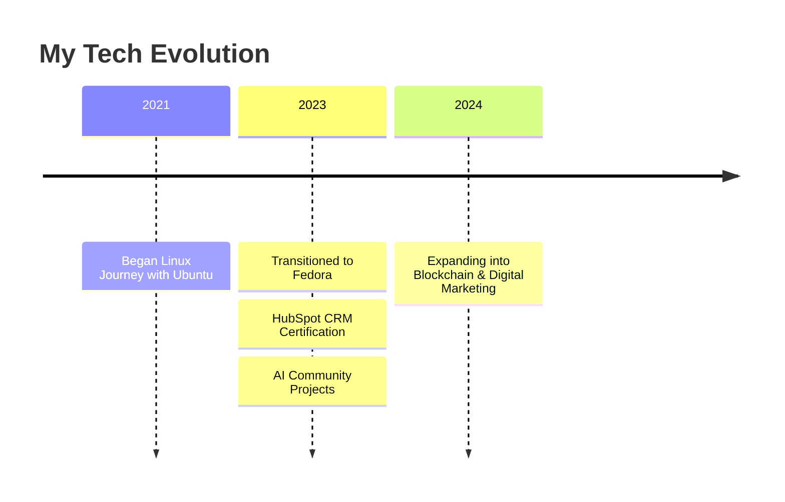

# ggittasseruwagi.github.io

# Hi there, I'm Ggitta Sseruwagi 👋

<div align="center">
  
</div>

## 🚀 Tech Journey



## 🎓 Education & Certifications

**Vaal University of Technology**
- 💻 Development Software & Programming Logic
- 🌐 Information Systems & Networking
- 💡 Entrepreneurship & Communication Skills

**Professional Certifications**
- 🎯 HubSpot CRM Certified
- 📱 Social Media Marketing Specialist
- 🤖 AI Implementation Specialist

## 🛠️ Tech Stack & Skills

```python
class TechEnthusiast:
    def __init__(self):
        self.operating_systems = {
            "linux": ["Fedora (Current)", "Ubuntu (2+ years)"],
            "command_line": "Advanced User"
        }
        
        self.digital_marketing = {
            "platforms": ["LinkedIn", "Instagram", "Facebook", "X"],
            "tools": ["HubSpot CRM", "Social Media Analytics"],
            "skills": ["Market Research", "Campaign Management"]
        }
        
        self.blockchain = {
            "interests": ["Cryptocurrency", "African Financial Markets"],
            "expertise": ["Cross-border Transactions", "Market Analysis"]
        }
        
        self.ai_ml = {
            "focus": "Community Impact Solutions",
            "projects": ["Local AI Implementation", "Social Impact Analysis"]
        }
```

## 🌍 Impact Projects

<div align="center">
  <table>
    <tr>
      <td align="center">
        
        <br />
        "Improving Lives Through AI"
      </td>
      <td align="center">
        
        <br />
        "Financial Inclusion Solutions"
      </td>
    </tr>
  </table>
</div>

## 📊 GitHub Analytics

<div align="center">
  
  
</div>

## 🌱 Current Focus

- 🐧 Advanced Linux system administration
- 🤖 AI implementation for social good
- 📊 Blockchain and cryptocurrency markets
- 🎯 Digital marketing strategies
- 👥 Community-driven projects

## 💡 Featured Projects

<div align="center">
  <a href="Your-AI-Project-URL">
    
  </a>
  <a href="Your-Crypto-Project-URL">
    
  </a>
</div>

## 🤝 Let's Collaborate!

<div align="center">
  
[](Your-LinkedIn-URL)
[](Your-Twitter-URL)
[](mailto:your.email@gmail.com)

</div>

## 📈 Contribution Graph


---
<div align="center">
  
  
  
</div>
